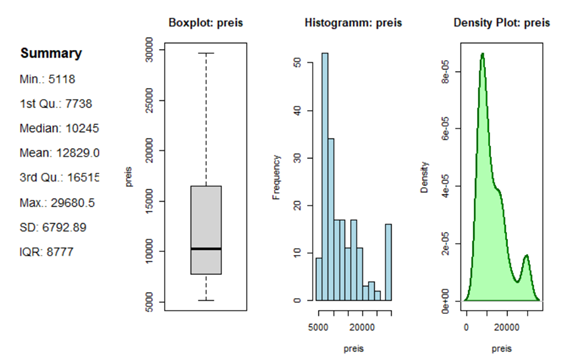
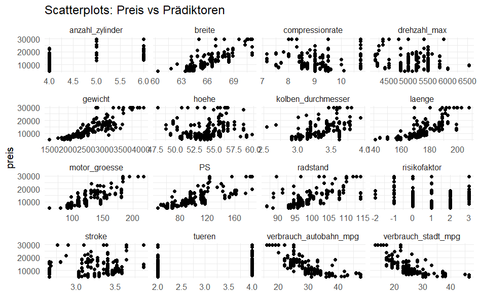
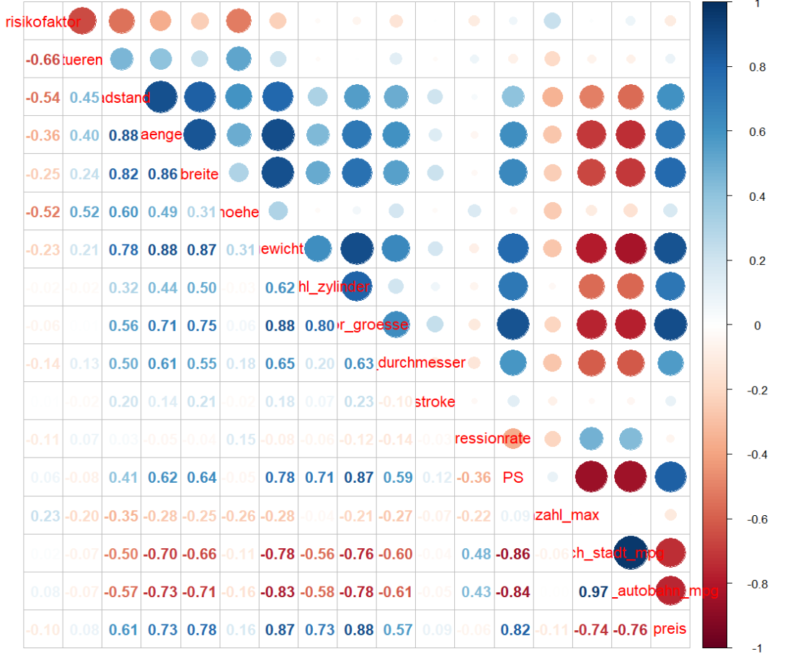
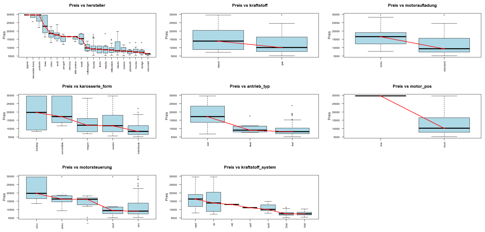
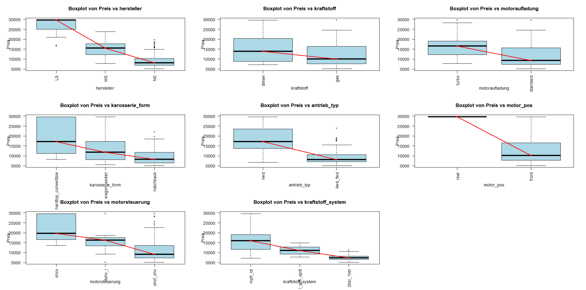
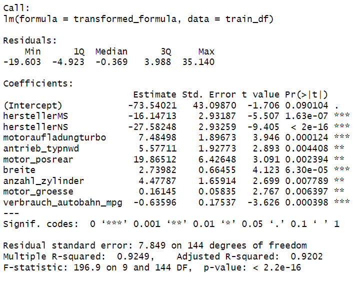
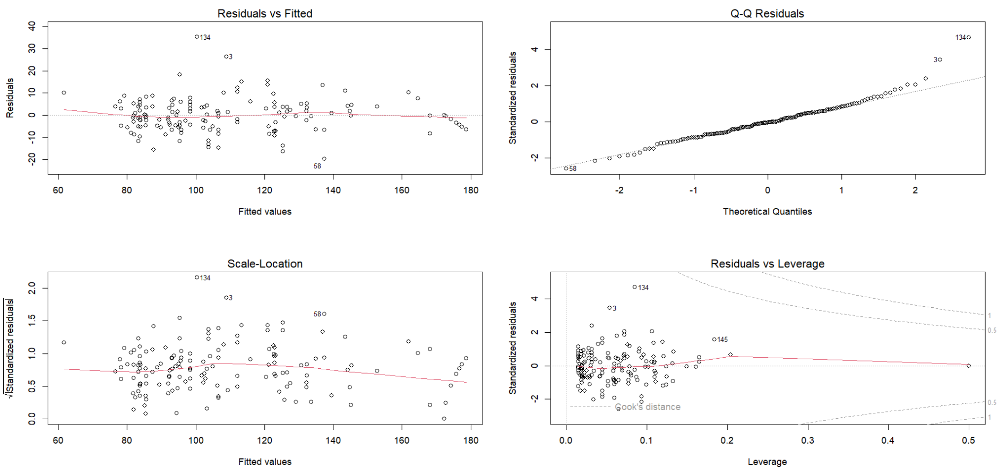
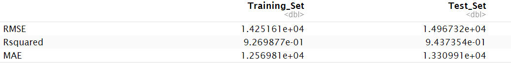
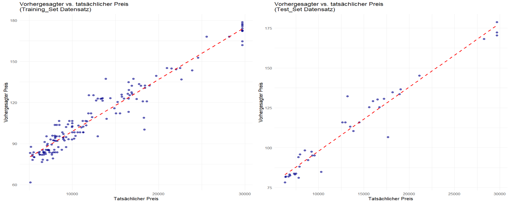

# Datenanalyse & Machine Learning zur Preisprognose von Automobilen

## Überblick
Dieses Studienprojekt untersucht, welche Faktoren den Preis von Automobilen bestimmen und nutzt diese zur Prognose von Fahrzeugpreisen mittels Machine Learning.  Dazu wurde ein Datensatz mit über 200 Fahrzeugen und 25 Variablen analysiert, bereinigt und modelliert.

## Ziele
- Datenbereinigung und Datenaufbereitung 
- Identifikation der wichtigsten Einflussfaktoren auf Fahrzeugpreise    
- Aufbau von Regressionsmodellen zur Preisprognose  
- Evaluierung und Optimierung der Regressionsmodelle 

## Datengrundlage
- **Datensatz:** `autos.csv` mit >200 Fahrzeugen  
- **Prädiktoren :**  
  - 16 quantitative Prädiktoren: z. B. Motorgröße, Gewicht, PS, Verbrauch  
  - 8 qualitative Prädiktoren : z. B. Hersteller, Karosserieform, Kraftstoffart, Antriebstyp  
- **Zielvariable:** preis  

## Vorgehen
1. **Datenbereinigung**  
   - Entfernung von Duplikaten 
   - Ersetzung unlogischer Werte (z. B. ? → NA)  
   - Entfernung fehlender Werte  
   - Anpassung von Datentypen 
   - Ersetzung von Ausreißern nach der IQR-Regel durch die Werte des ersten bzw. dritten Quartils.  

2. **Univariate Datenanalyse**
    Sie ist wichtig um einzelne Variable zu verstehen (Wertebereiche, Skalierung, verteilung). Sie bildet eine wichtige Grundlage, um notwendige Transformationen in späteren Analyseschritten vorzunehmen. 
   - Descriptive Statistik, 
   - Histogramme, 
   - density plot  

3.**Multivariate Datenanalyse**
   Sie dient dazu, Zusammenhänge zwischen der Zielvariable und Prädiktoren zu erkennen.
   - Scatterplots
   - Korrelationsplot  
   - Boxplots    

3. **Feature Engineering**
   - Transformation von Merkmalen: Kategorien qualitativer Merkmale werden nach ihrer Einflussstärke auf die Zielvariable Preis     zusammengefasst (Binning), um die Anzahl der Kategorien zu reduzieren.
   - erste Merksmalauswahl:Prädiktoren mit schwacher Korrelation zur Zielvariable (r < 0,2) werden entfernt; bei stark korrelierten Prädiktoren untereinander (r ≥ 0,8) wird einer entfernt.
   - zweite Merkmalauswahl: Stepwise-Regression mit Forward- und Backward-Selection unter Verwendung des AIC-Kriteriums.

4. **Modellbildung**  
   - Multiple lineare Regression   
   - Überprüfung der Modellannahmen (Linearität, Homoskedastizität, Normalverteilung)  
   - Transformation der Zielvariablen (Box-Cox) zur verbesserung des Modells 

5. **Modellvalidierung**  
   - Trainings-/Testsplit (80/20)  
   - Performance-Bewertung: R2 auf train und Testdaten  

## Ergebnisse

- **Starke Einflussfaktoren:** Motorgröße, Gewicht, PS, Verbrauch, Herstellersegment  
- **Negativer Zusammenhang:** Höherer Preis ↔ schlechtere Kraftstoffeffizienz  
- **Bestes Modell:** Transformierte multiple Regression mit hoher Prognosegüte  

## Ausblick
- Erweiterung um nichtlineare Modelle (z. B. Random Forest, Gradient Boosting)  
- Einbezug größerer und aktuellerer Fahrzeugdatensätze  
- Anwendung für Preisprognosen in Echtzeit (z. B. Gebrauchtwagenportale)  

## Technologien
- **Programmiersprache:** R / Python (abhängig von Umsetzung)  
- **Methoden:** Explorative Datenanalyse, Korrelationsanalyse, multiple lineare Regression, Modellvalidierung  
- **Bibliotheken:** pandas, numpy, matplotlib, seaborn, scikit-learn (bei Python)  

